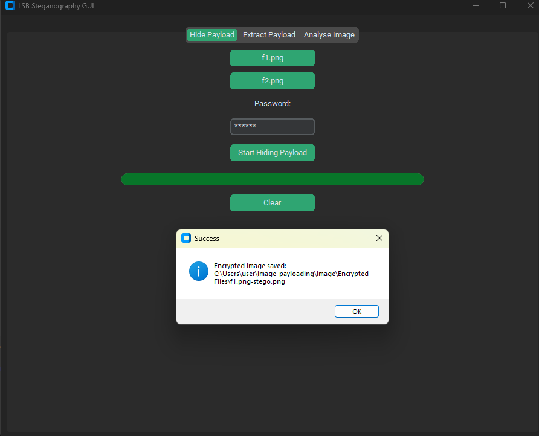
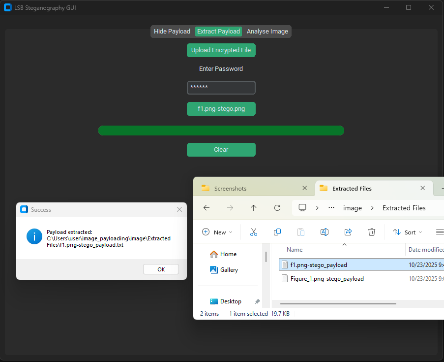
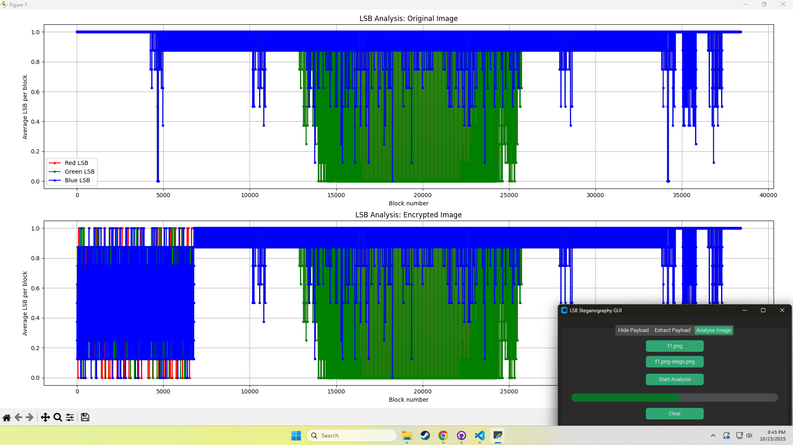

Image Payloading

### 🔐 Image Payloading Encryption and Decryption with LSB

This project demonstrates **image payload encryption and decryption** using **Least Significant Bit (LSB) steganography**, a method of concealing encrypted data within digital images. It combines **cryptography** and **steganography** to enhance data confidentiality and security.

---

### 🧠 Concept Overview

1. **Encryption Phase**

   * The plaintext message (payload) is first **encrypted** using a symmetric encryption algorithm (e.g., AES or custom cipher).
   * This transforms readable text into **ciphertext**, preventing unauthorized interpretation even if extracted.

2. **Embedding Phase (LSB Steganography)**

   * The encrypted payload is then hidden within a **cover image** by modifying the **least significant bits (LSBs)** of the pixel values.
   * Because changes to LSBs cause **minimal distortion**, the visual appearance of the image remains nearly identical to the original.
   * Each bit of the encrypted message replaces the LSB of the RGB values of the image pixels in sequence.

3. **Extraction Phase**

   * During decryption, the process is reversed.
   * The program scans the stego-image pixel-by-pixel, retrieves the LSBs, and reconstructs the binary data stream.

4. **Decryption Phase**

   * The extracted binary data is **decrypted** using the same key used in encryption.
   * The original plaintext message is restored and displayed or stored securely.

---

### 🔄 Workflow Summary

| Stage | Operation                | Description                                                |
| ----- | ------------------------ | ---------------------------------------------------------- |
| 1     | **Encrypt Message**      | Convert plaintext into ciphertext using an encryption key. |
| 2     | **Embed with LSB**       | Hide the encrypted bits inside pixel LSBs of the image.    |
| 3     | **Generate Stego Image** | Output the image visually identical to the original.       |
| 4     | **Extract Payload**      | Read LSBs to reconstruct the hidden binary data.           |
| 5     | **Decrypt Message**      | Use the same key to decrypt ciphertext back to plaintext.  |

---

### ⚙️ Key Features

* Supports **text-to-image encryption** and **image-to-text decryption**.
* Uses **LSB substitution** for imperceptible data hiding.
* Implements **cryptographic key-based encryption** for payload protection.
* Maintains image quality with minimal distortion (high PSNR values).

---

### 🧩 Example Use Case

* Secure message transmission through images in online communication.
* Hiding confidential data in media for digital forensics or authentication.
* Protecting sensitive files or metadata in multimedia systems.

---

### 🔒 Security Insight

While LSB steganography conceals data effectively, combining it with **encryption** significantly strengthens security. Even if the hidden data is detected, it remains unreadable without the correct decryption key — ensuring **double-layered protection**.

---

### 🧾 References

* Johnson, N. F., & Jajodia, S. (1998). *Exploring Steganography: Seeing the Unseen.* IEEE Computer.
* Katzenbeisser, S., & Petitcolas, F. A. P. (2000). *Information Hiding Techniques for Steganography and Digital Watermarking.*

---

### 📦 Output

* **Input:** Plaintext message + Cover image + Encryption key
* **Output:** Stego image + Recovered plaintext after decryption

==========

Platform independent Python tool to implement LSB image steganography and a basic detection technique. Features:

 - Encrypt data before insertion.
 - Embed within LSBs.
 - Extract hidden data.
 - Basic analysis of images to detect LSB steganography.

How to use:

    $ python lsb.py 
    LSB steganogprahy. Hide files within least significant bits of images.
    
    Usage:
      lsb.py hide <img_file> <payload_file> <password>
      lsb.py extract <stego_file> <out_file> <password>
      lsb.py analyse <stego_file>
    
    $ python lsb_gui.py 

 
Hiding Payload on image:

### Hiding Payload on Encrypted Image

### Extracting Payload on Encrypted Image

### Analyse

Notes
-----
 
 - It is entirely possible to have images with the mean of LSBs already very close to 0.5. In this case, this method will produce false positives.
 - More elaborate theoretical methods also exist, mostly based on statistics. However, false positives and false negatives cannot be completely eliminated.

